# Ankur's Dotfiles

## Desktop

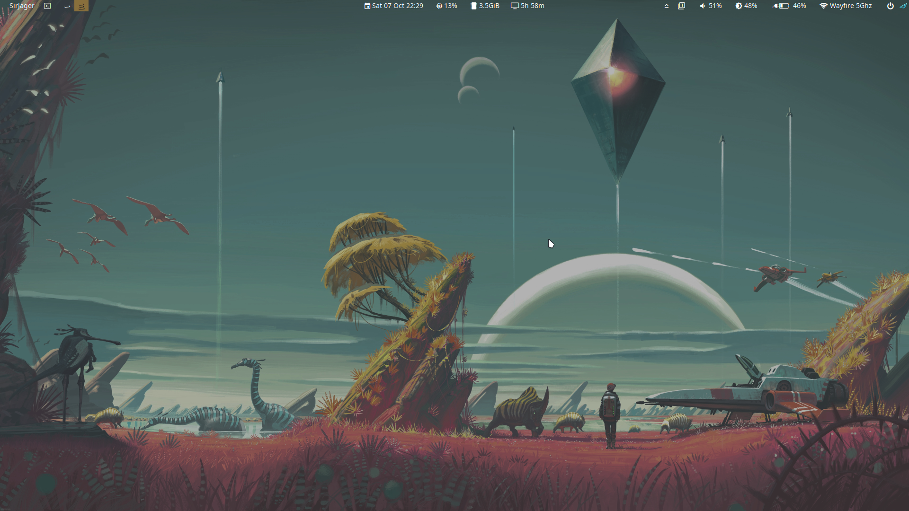

## Keybindings Helper

## Application launcher

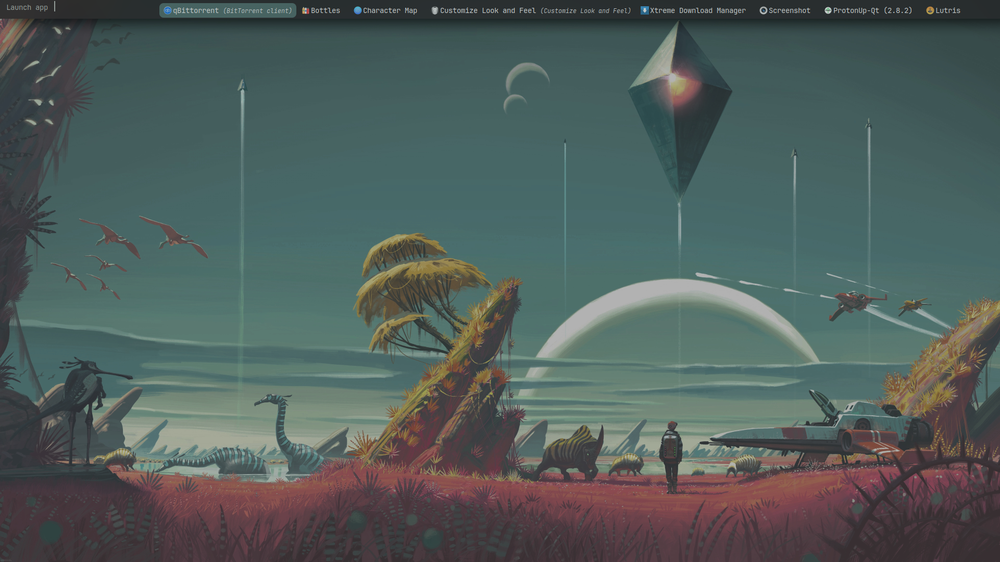

## Bookmark Launcher

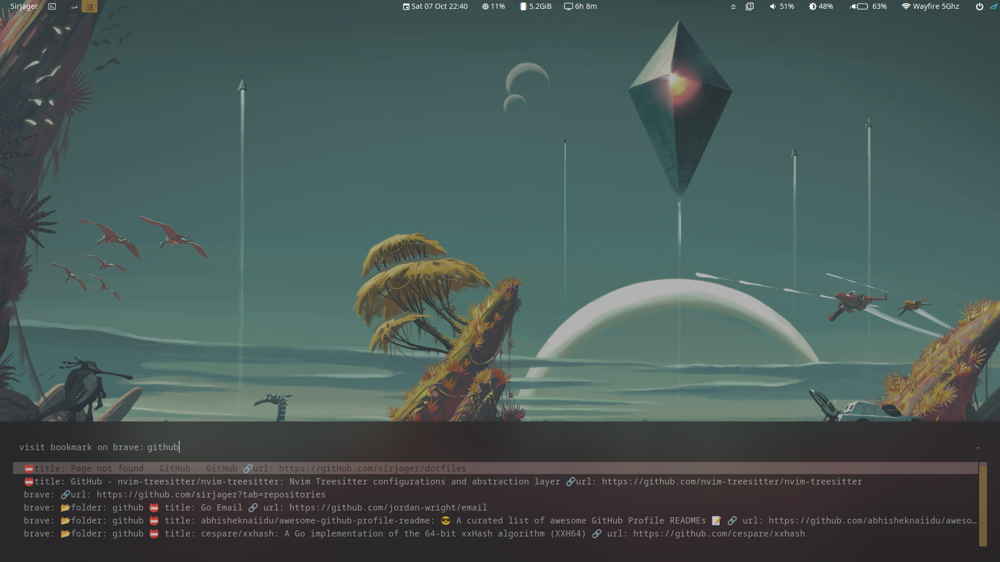

## Browser's History Launcher

## Password Manager

All Options

 Copy to clipboard

Create password
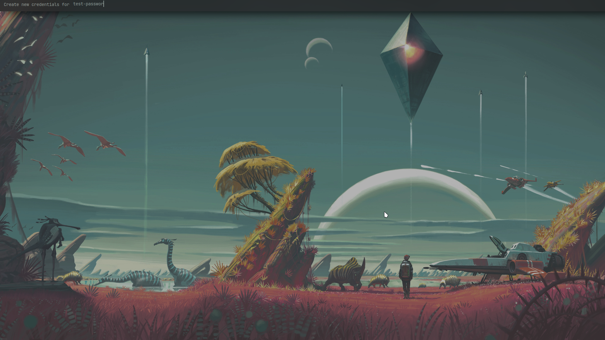
Remove password

## Wallpaper Changer

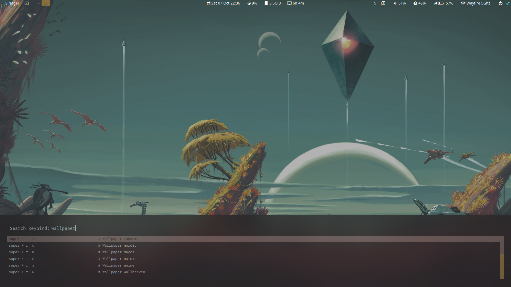

## Kitty Terminal

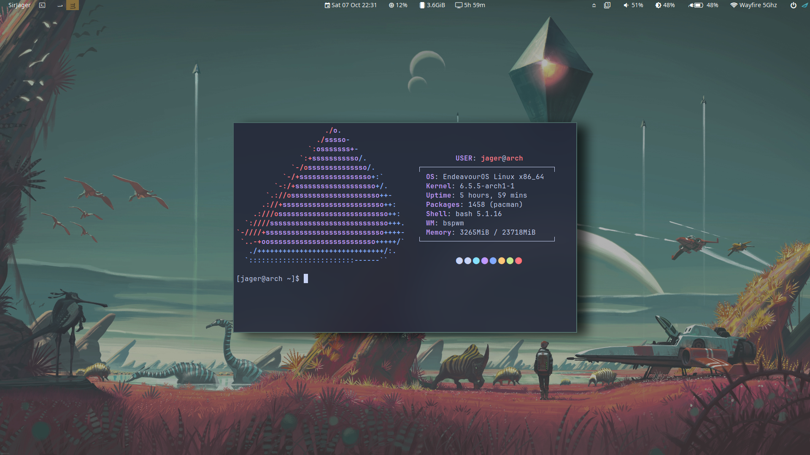

## Kitty Terminal With Tmux

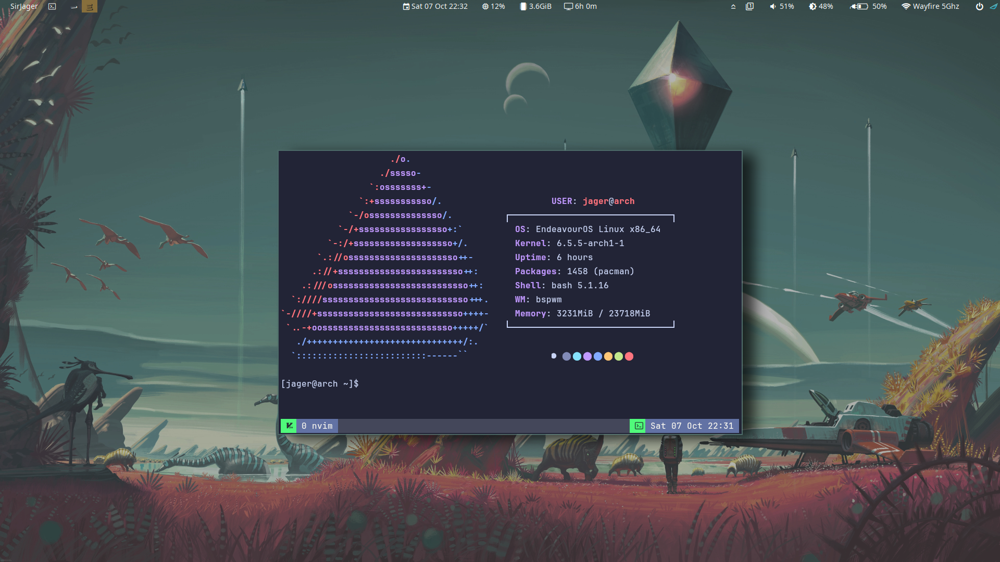

## Tmux Splits

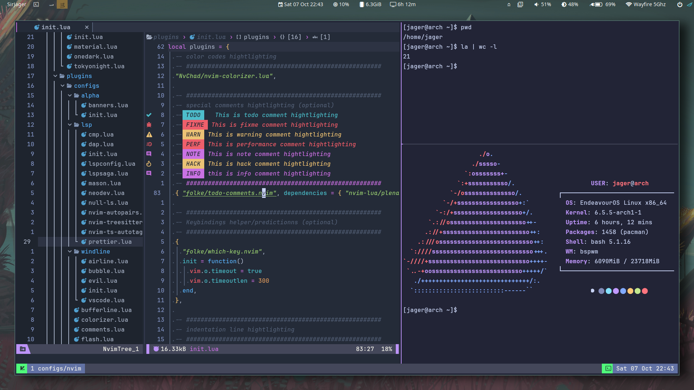

## Neovim

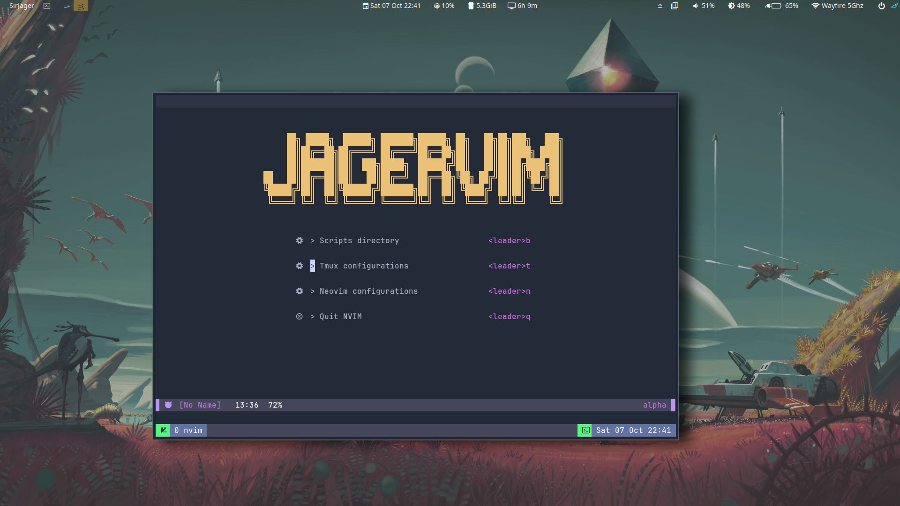
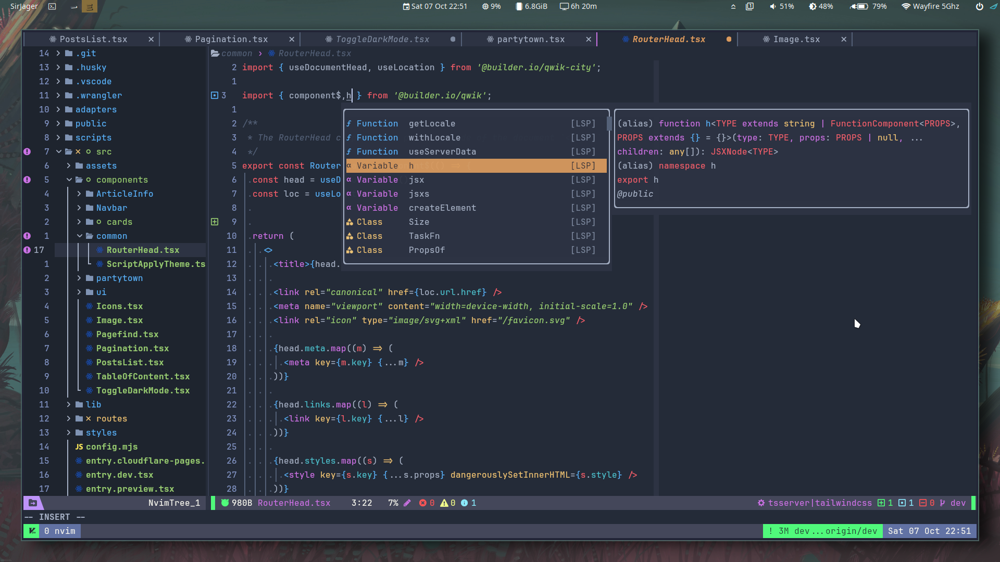
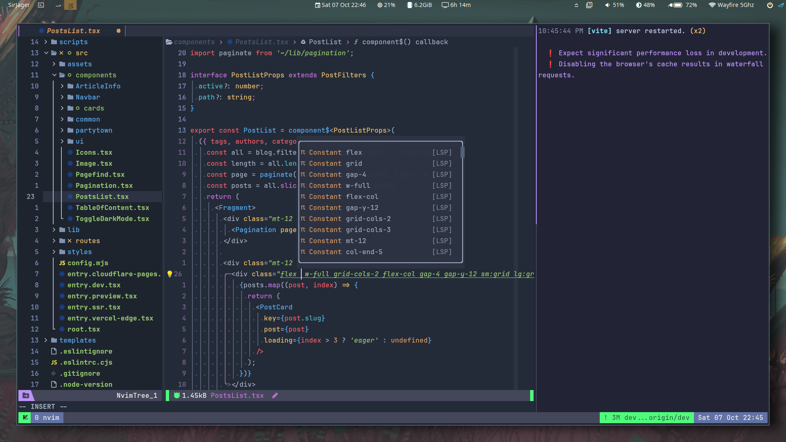

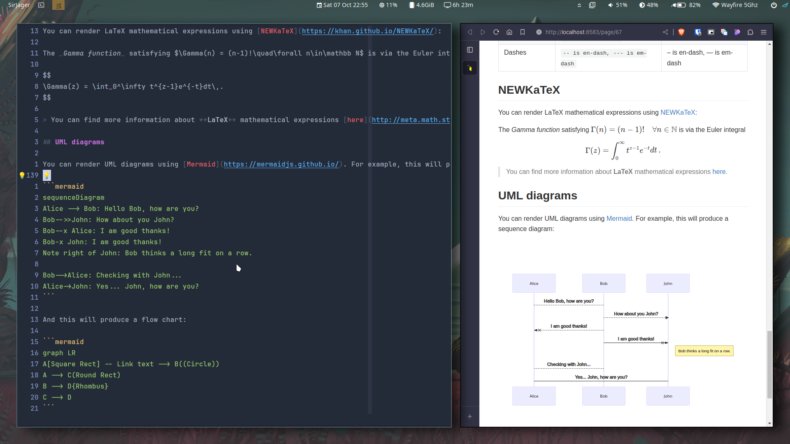

### Database Client

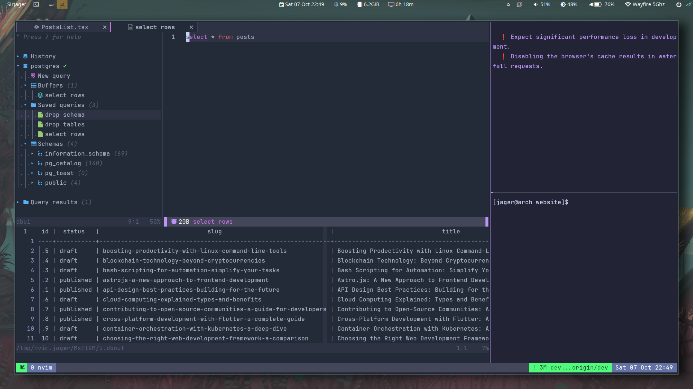
